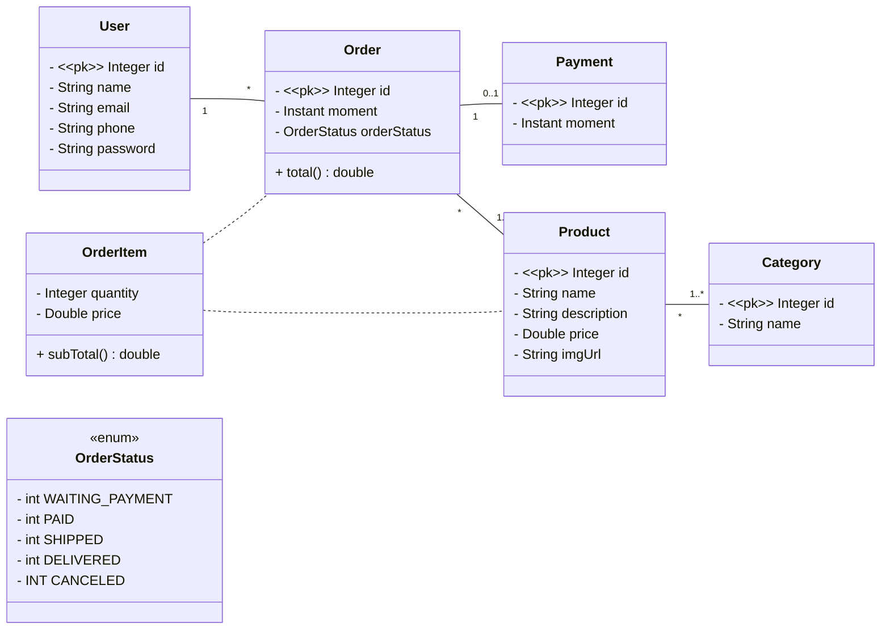
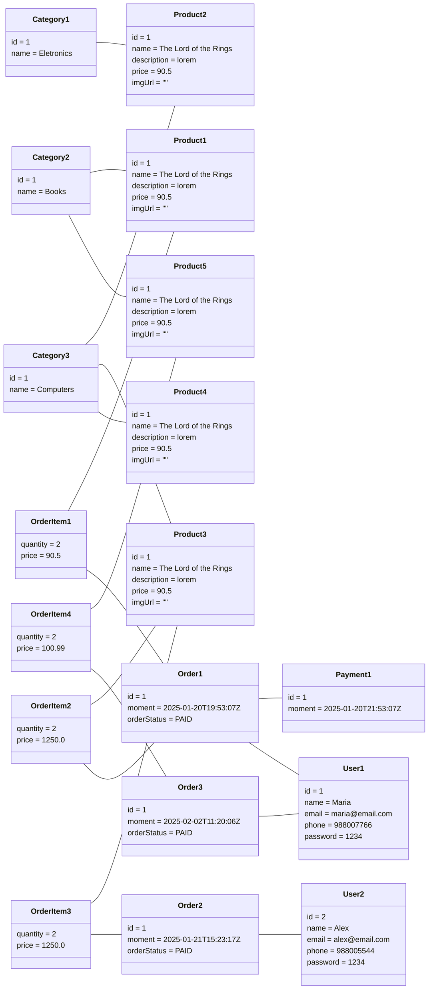

# Projeto spring boot e JPA/Hibernate

## Objetivo

Este é um projeto de estudo para back-end desenvolvido em Java com Spring Boot, utilizando Maven para gerenciamento de dependências, Postman para testes de API, banco de dados H2 para desenvolvimento e PostgreSQL para produção.
O sistema baseia-se em um usuário que possui uma lista de Pedidos, onde cada Pedido contém os Produtos, com suas informações e cada Pedido tem seu pagamento único.

## Tecnologias

     

## Arquitetura

O sistema foi desenvolvido seguindo a arquitetura MVC, com as seguintes camadas:

- **Entity**: Classes das entidades do sistemas (User, Pedido,Produto, Pagamento, etc.).
- **Controller**: Classes que recebem as requisições HTTP e interagem com as entidades do sistema para processar os dados.
- **Service**: Classes que contêm a lógica de negócios do sistema.
- **Repository**: Classes que fazem o acesso ao banco de dados.

### Modelo de domínio



### Instância de domínio

Essa instância de domínio foi carregada no perfil de testes no banco de dados H2.



## Execução do projeto

1. Clone o repositório:

    ```git
    git clone https://github.com/viniciussartini/springjpa.git
    ```

2. Abra no seu editor de preferência: IntelliJ IDEA, Eclipse, SpringTool Suite, VS Code

3. Configure o banco de dados

    - Para usar o H2 ou PostgreSQL, ative o profile `test` ou `dev`, respectivamente. Abra o arquivo [Application Properties](./src/main/resources/application.properties):

    ```java
    spring.profiles.active=test/dev
    ```

4. Para executar o projeto rode o arquivo [SpringjpaApplication.java](./src/main/java/br/com/example/springjpa/SpringjpaApplication.java)

## Teste da API

1. Abra o Postman.
2. Envie as requisições para os endpoints da API.
    **Endpoints da API**
    **Usuários:**
    `GET /users` Lista todos os usuários.
    `GET /users/{id}` Lista o usuário pelo id informado.
    `POST /users`: Cadastra um novo usuário.
    `PUT /users/{id}`: Atualiza as informações do usuário com id informado.
    `DELETE /users/{id}`: Deleta usuário através do id informado.
    **Produtos:**
    `GET /products` Lista todos os produtos.
    `GET /products/{id}` Lista o produto pelo id informado.
    **Categorias:**
    `GET /categories` Lista todas as categorias de produto.
    `GET /categories/{id}` Lista a categoria de produto pelo id informado.
    **Pedidos:**
    `GET /orders` Lista todos os pedidos.
    `GET /orders/{id}` Lista o pedido pelo id informado.

## Próximos Passos

1. Implementar os métodos `POST`, `PUT` e `DELETE` de produtos, categorias e pedidos.
